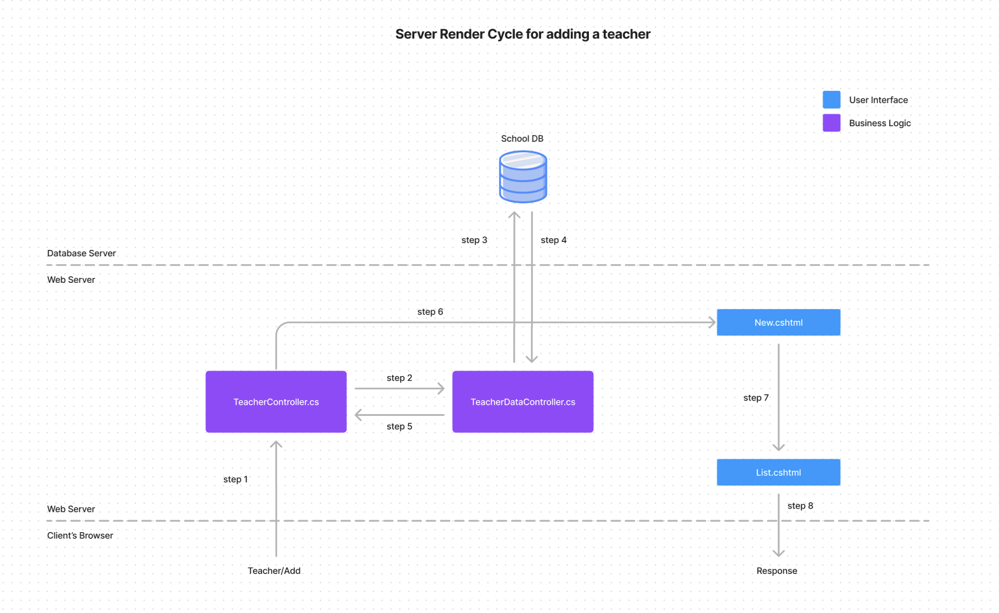
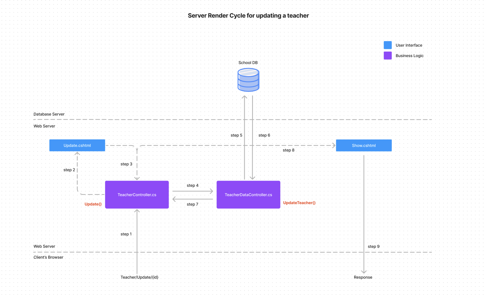
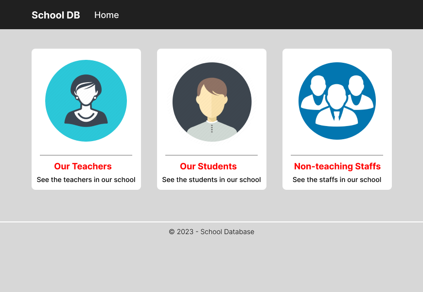
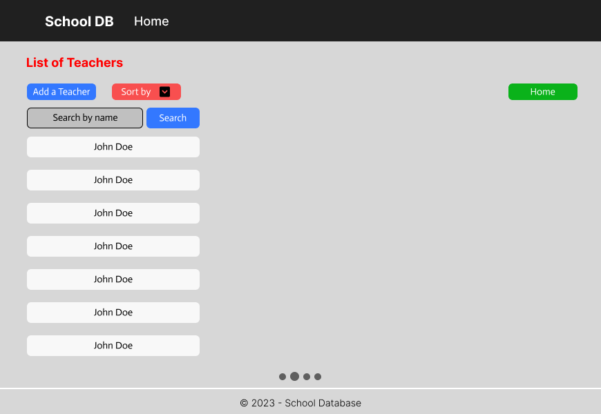
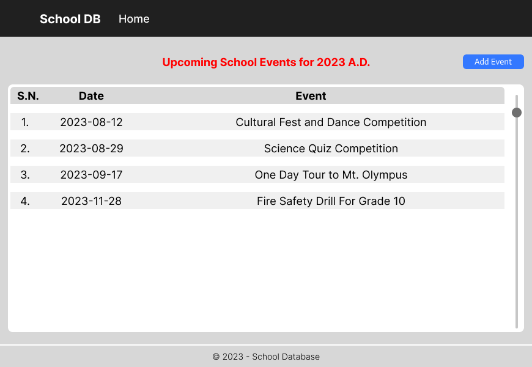
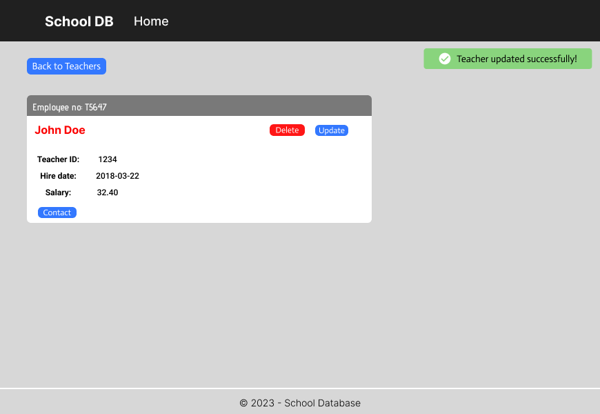

# Cumulative

**Overview**

This documentation outlines the features for the cumulative assignments of C#.

---

## Teacher Addition

---

## Teacher Update

---

## Wireframes for possible features in the project

*Index Page*

*Search Page*

*Events Log Page*

*Notification Feature*

---

### Initiatives covered in C2

1. The server rendered cycle while creating and removing a teacher.
2. JS validation while inserting a teacher using the form.
3. Creating a teacher using Ajax XHR request.
4. CURL POST request for JSON data test during insert (Error prone).

---

### Initiatives covered in C3

1. The server rendered cycle while updating a teacher.
2. JS (client-side) validation while updating a teacher using the form.
3. Updating a teacher using Ajax XHR request.
4. Wireframes for possible features in the project.

Also, fixed the server rendered cycle for the add feature of a teacher.
